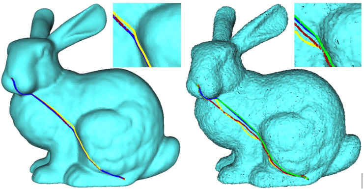

# LibGeodesicOPPGC
## Implementation of:
# Optimal Point-to-Point Geodesic Path Generation on Point Clouds
### Authors: Dr. Alexander Agathos(1) & Prof. Philip Azariadis(2)
### (1)University of Aegean, (2) University of West Attica

    

    

